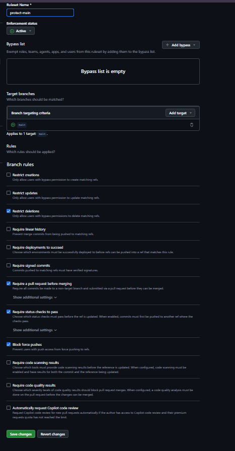

# ds881-curriculo-20246038

> Currículo online desenvolvido como projeto individual para a disciplina **DS881**.

🔗 **[Ver currículo em produção](https://ibrunny.github.io/ds881-curriculo-20246038)**

---

## 🚀 Execução Local com Docker

### Pré-requisitos
- [Docker](https://docs.docker.com/get-docker/) instalado
- [Docker Compose](https://docs.docker.com/compose/install/) instalado

### Subindo o ambiente

```bash
# 1. Clone o repositório
git clone [https://github.com/ibrunny/ds881-curriculo-20246038.git](https://github.com/ibrunny/ds881-curriculo-20246038.git)
cd ds881-curriculo-20246038

# 2. Suba o container
docker compose up --build

# 3. Acesse no navegador
# http://localhost:8080

## Branch Protection
